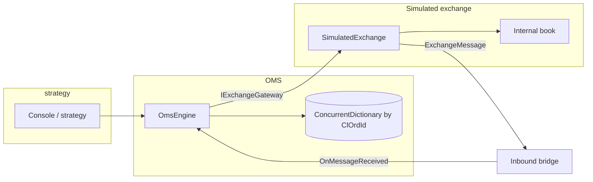

# OMS (Order Management System) — simulation

In-memory Order Management System for **one** simulated exchange, with async venue responses, reconciliation, and NUnit tests. Targets **.NET Framework 4.8.1** (main app) and **.NET 4.8.1** (test project SDK-style).

---

## High-level flow

1. Client (strategy) calls the OMS:
   - `SubmitNewOrderAsync(quantity)` → generates `ClOrdId`, inserts a `TrackedOrder`, moves `New` → `PendingAck`**, then calls `IExchangeGateway.SubmitNewOrderAsync`.

2. Exchange gateway (`SimulatedExchange` in the demo) accepts the command after latency, updates its internal book, and may send async inbound messages (ack, reject, fills, cancel/replace outcomes, venue cancels). Each message carries a monotonic sequence number and fills carry an **`ExecId`** for idempotency.

3. Inbound path: the gateway calls `IInboundExchangeSink.OnMessageReceived` (wired from `OmsEngine` via a small bridge in `Program`). `OmsEngine.OnMessageReceived` looks up the order under `ConcurrentDictionary<string, TrackedOrder>`, takes the **per-order lock**, and runs **`ApplyExchangeMessage`**, which dispatches by message type (ack, fill, cancel ack, replace ack, etc.).

4. Order state is updated **only under that lock** so concurrent callbacks for the same `ClOrdId` stay deterministic.

5. Watchdog (`System.Threading.Timer`, ~100 ms): if an order stays **`PendingAck`**, **`PendingCancel`**, or **`PendingReplace`** longer than **500 ms**, it moves to **`StatusUnknown`** and runs **`QueryExchange`**, then **`ReconciliationMerge`** to align with venue truth without blindly wiping local data.

6. Reconciliation harness (console): scenarios run end-to-end and print tables comparing OMS snapshot vs **`QueryExchange`** on the simulator.



---

## Order lifecycle (states)

| State | Meaning |
|--------|---------|
| **New** | Created locally; about to send to venue. |
| **PendingAck** | New order sent; waiting for accept/reject. |
| **Open** | Working; **no** fills yet (`CumQty == 0`). |
| **PartiallyFilled** | Working; `0 < CumQty < OrderQty`. Remainder can be **cancelled** or hit by **venue cancel**. |
| **PendingReplace** | **Replace** sent; waiting for replace ack/reject. |
| **PendingCancel** | **Cancel** sent; waiting for cancel ack/reject (**fills can still arrive**). |
| **Filled** | `CumQty >= OrderQty` (terminal). |
| **Cancelled** | Working order removed without full fill (terminal). |
| **Rejected** | New order rejected (or inferred after reconcile) (terminal). |
| **StatusUnknown** | Pending too long or ambiguous; **QueryExchange** expected. |

**Terminal states:** `Filled`, `Cancelled`, `Rejected` (`TrackedOrder.IsTerminal()`).

---

## Inbound message handling (conceptual)

- **Duplicate `SequenceNumber`**: ignored (stale/replay).
- **Duplicate fill `ExecId`**: do not double-count; still record the new sequence if the transport retries with a new seq (handled at `ApplyExchangeMessage` / `ApplyFill`).
- **Out-of-order**: e.g. **fill before new-order ack** — allowed; cumulative qty and `Open` / `PartiallyFilled` / `Filled` follow from quantities.
- **Replace**: **`SubmitReplaceAsync`** is one outbound action (same `ClOrdId`); **`ReplaceAck`** updates **`OrderQty`**; **`ReplaceReject`** restores working state via **`AssignOpenOrPartial`**.

---

## Key interfaces

| Interface | Role |
|-----------|------|
| **`IExchangeGateway`** | Outbound: new order, replace, cancel, **`QueryExchange`** (reconciliation snapshot). |
| **`IInboundExchangeSink`** | Inbound: **`OnMessageReceived(ExchangeMessage)`**. |
| **`IOmsEngine`** | Strategy-facing API on **`OmsEngine`**. |

---

## Projects

| Project | Description |
|---------|-------------|
| **OMS** | Console host + `OmsEngine` + `SimulatedExchange` + messages and merge logic. |
| **OMS.Tests** | NUnit tests; mostly **`FakeRecordingGateway`** + direct **`OnMessageReceived`**; optional **`SimulatedExchange`** smoke tests. |

### Build & run

```powershell
# Console harness
msbuild OMS.sln /p:Configuration=Debug
.\OMS\bin\Debug\OMS.exe

# Tests
dotnet test OMS.Tests\OMS.Tests.csproj
```

---

## Design notes (interview talking points)

- **Ownership**: Production would swap **`SimulatedExchange`** for per-venue gateways (REST/FIX/WebSocket); the OMS contract stays **`IExchangeGateway` + messages**.
- **Back-pressure**: This sample does not cap intents or queue depth; a real system would bound queues and surface pressure to the strategy.
- **Tests**: Prefer **fake gateway + message replay** for OMS correctness; simulator tests are optional wiring smoke.

